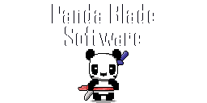

# Kitchen Cthulhu

[Game Design Doc](https://docs.google.com/document/d/1V6WJQ0nylHAiPOP4INVv6p-xo8GPl4U6ZOB27i1bJR8/edit#heading=h.ed7osj5yobct)

Start your kitchen and get cooking. What will find it's way into your restaurant...?

    

---
### Bugs
| Item | Notes | Status |
|----------|:-------------:|------:|
| Chop animation won't show with multiple items | N/A | Not Started |

---

### Implementation Progress
| Item | Notes | Status |
|----------|:-------------:|------:|
| ~~Take items from fridge~~ | N/A | Done |
| ~~Take items from fridge Interface~~ | N/A | Done |
| ~~Chop items~~ | N/A | Done |
| ~~Progress Indicator for Chop & Cook~~ | Reusable component | Done |
| ~~Cook & Burn Burgers~~ | N/A | Done |
| Plate Items | N/A | Not Started |
| Host Stand | N/A | Not Started |
| Customer Queue | N/A | Not Started |
| Seat Customer | N/A | Not Started |
| Take Order | N/A | Not Started |
| Serve Customer | N/A | Not Started |
| Clean Table and Wash Dishes | N/A | Not Started |
| ... | ... | ... |

---

## Developed By

    

